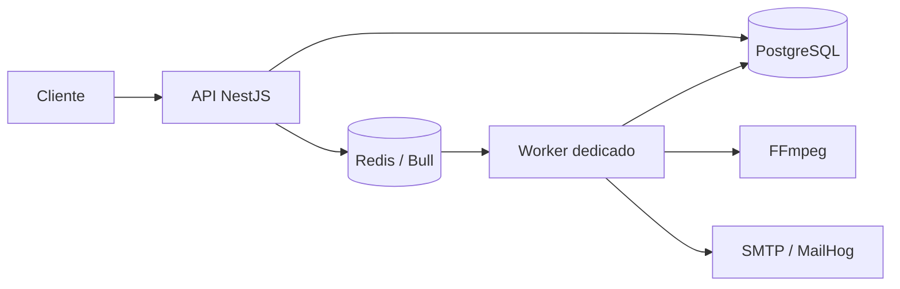
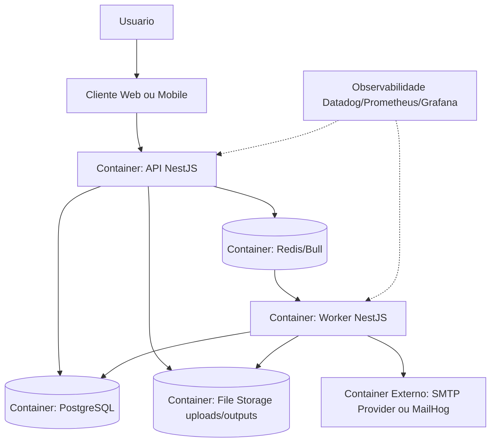
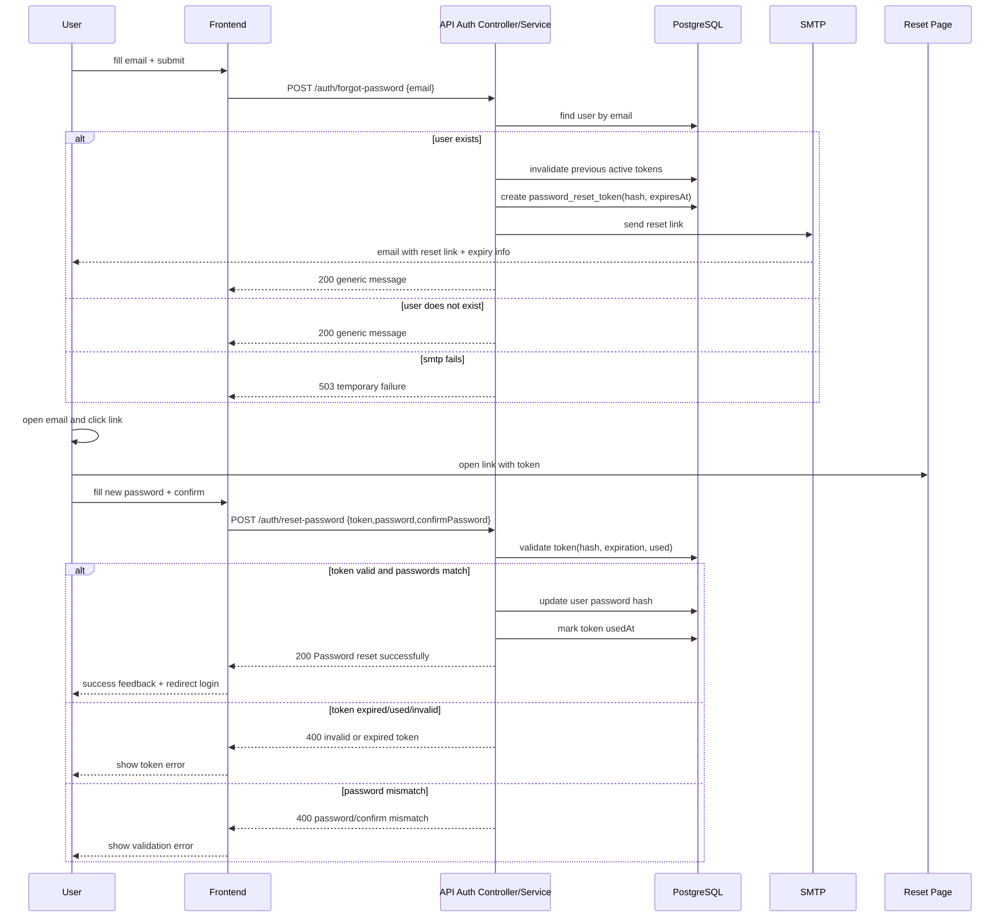
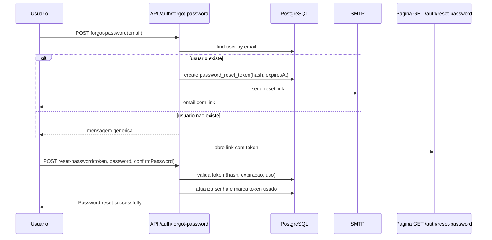
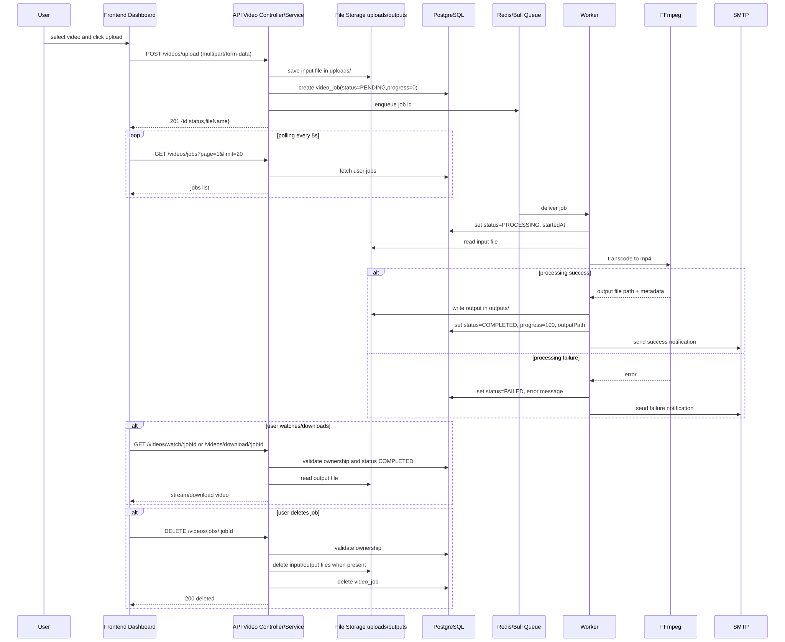
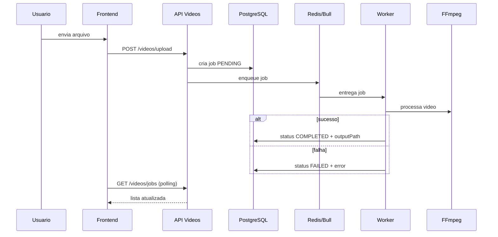

# Arquitetura

## Requisito de Documentacao

- Obrigatorio: diagrama de arquitetura (atendido neste documento na secao "Diagrama de Arquitetura").
- Opcional (diferencial): diagramas C4 e de sequencia.

## Visao Geral

A implementacao atual usa uma arquitetura em camadas com separacao entre API HTTP, fila de processamento, persistencia e worker dedicado. O repositorio nao esta organizado como monorepo de varios apps; a aplicacao principal e o worker vivem no mesmo projeto raiz.

## Componentes

### API

Arquivo de entrada: src/main.ts

Responsabilidades:

- expor endpoints HTTP
- autenticar usuarios com JWT
- receber uploads
- persistir jobs
- publicar jobs na fila
- expor Swagger e health check
- emitir logs estruturados com traceId e ip

### Worker

Arquivo de entrada: src/main.worker.ts

Responsabilidades:

- consumir jobs da fila video-processing
- atualizar status do job
- processar o arquivo com FFmpeg
- persistir outputPath no banco
- enviar notificacao por email
- gravar notificacao na tabela notifications

### Banco de Dados

- PostgreSQL
- Prisma ORM
- entidades principais: users, video_jobs, notifications

### Fila

- Redis
- Bull
- concorrencia controlada por VIDEO_WORKER_CONCURRENCY

## Diagrama de Arquitetura

Imagem renderizada:





## Diagrama C4 (Container)

Imagem renderizada:





## Diagrama de Sequencia (Esqueci Minha Senha)

Imagem renderizada:





## Diagrama de Sequencia (Upload e Processamento de Video)

Imagem renderizada:





## Fluxo de Processamento

1. O cliente autentica com JWT.
2. A API recebe o arquivo e salva em uploads/.
3. A API cria um registro em video_jobs com status PENDING.
4. A API publica o job na fila.
5. O worker consome o job e muda o status para PROCESSING.
6. O worker extrai frames do video com FFmpeg e gera um arquivo ZIP.
7. O worker persiste outputPath e finaliza como COMPLETED ou FAILED.
8. O worker envia email e registra a notificacao.
9. O cliente consulta o status e faz download do artefato final.

## Decisoes de Arquitetura

- API e worker separados em runtime para permitir escalar o processamento sem bloquear requests HTTP.
- Redis foi usado como base da fila por simplicidade operacional e boa integracao com Bull.
- PostgreSQL concentra a fonte de verdade dos jobs e notificacoes.
- Datadog tracing e logs estruturados ajudam a demonstrar observabilidade no desafio.
- Kubernetes manifests foram adicionados em k8s/ para deploy da API, worker e dependencias basicas.

## Observabilidade

- Health check: /health
- Swagger: /api-doc
- Logs estruturados com traceId, path, statusCode, durationMs e ip
- Prometheus e Grafana para ambiente local

## Execucao Local

### Docker Compose

```bash
docker compose up -d postgres redis mailhog prometheus grafana
docker compose up -d --build api worker
```

### Runtime separado

- api: atende HTTP na porta 3001 e publica jobs
- worker: processa fila sem expor porta HTTP

## CI/CD

O workflow em .github/workflows/ci-cd.yml executa testes, build, scan de seguranca, publica imagem no GHCR e aplica os manifests de k8s/ quando o secret KUBE_CONFIG_BASE64 estiver configurado.
